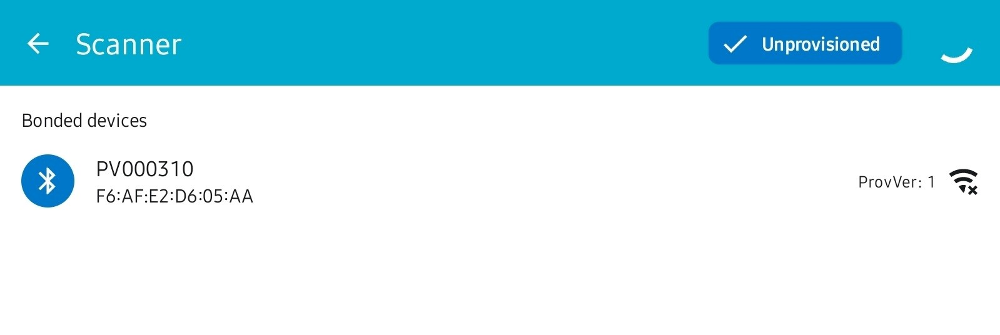
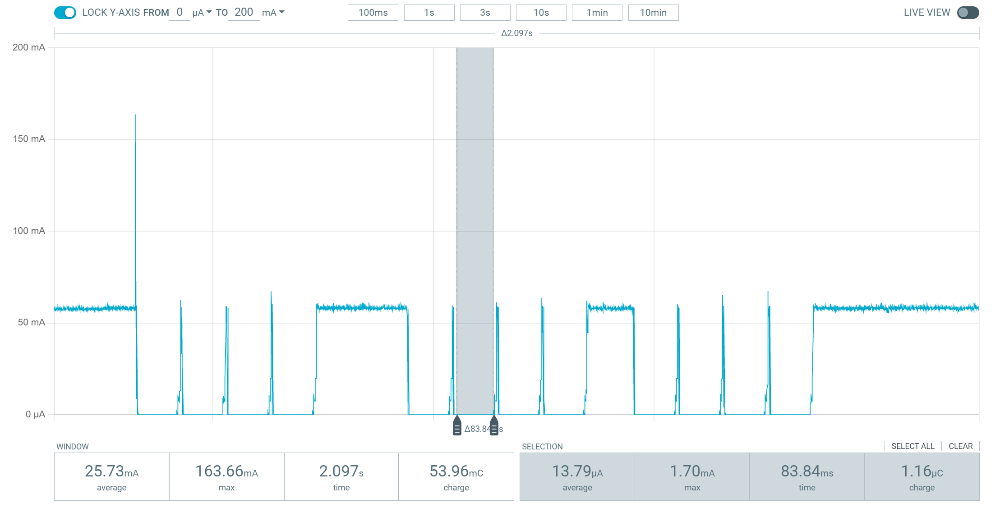

# Wi-Fi Provisioning Demo

<i> Based on [Wi-Fi: Provisioning Service](https://github.com/nrfconnect/sdk-nrf/tree/v2.2.0/samples/wifi/provisioning) in nRF Connect SDK and [Rallare's Wi-Fi Provisioning demo](https://github.com/Rallare/fw-nrfconnect-nrf/tree/provisioning_demo_app/samples/wifi/provisioning).<br>
SDK version: v2.2.99-dev3<br>
Cherry-picked commit:
https://github.com/nrfconnect/sdk-zephyr/commit/c4b528788ce7927f0f8a7da487a8f5c8bbe5643e
</i>

# Table of Contents
1. [Requirements](#requirements)
2. [Configuration](#configuration)
    1. [Provisioning](#provisioning)
    2. [Unprovision](#unprovision)
    3. [Current measurement](#current-measurement)
3. [User interface](#user-interface)
4. [Testing](#testing)
5. [Troubleshooting](#troubleshooting)
    1. [Provisioning issues](#provisioning-issues)
    2. [Power Profiler issues](#power-profiler-issues)
    3. [nRF7002 DK issues](#nrf7002-dk-issues)
6. [Comments regarding power saving mode](#comments-regarding-power-saving-mode)
7. [Target Wake Time (TWT)](#target-wake-time-twt)

## Requirements
- nRF7002 DK (nrf7002dk_nrf5340_cpuapp)
- PPK2

You also need a phone or tablet with the nRF Wi-Fi Provisioner app ([Android](https://play.google.com/store/apps/details?id=no.nordicsemi.android.wifi.provisioning)|[Apple](https://apps.apple.com/gb/app/nrf-wi-fi-provisioner/id1638948698)), and a computer with the [Power Profiler app](https://www.nordicsemi.com/Products/Development-tools/nRF-Connect-for-Desktop).

<br>

## Configuration

### Provisioning
1. Turn the DK on, and wait 10 seconds for it to start up.
2. Open the nRF Wi-Fi Provisioner app and click <b>Start</b>.
3. Click on the device that appears and select <b>Pair</b> in the pop-up.



4. Click on <b>Start provisioning</b>.


5. Select the network to which you want to provision the device and enter the network password.
6. Click on <b>Provision</b> to provision the device.


7. Wait a few seconds. When the device is provisioned, you should see the following:


### Unprovision
1. Open the nRF Wi-Fi Provisioner app and click <b>Start</b>.
2. Unselect <b>Unprovisioned</b> in the upper right corner to get a list of provisioned devices. 


3. Click on the device you want to unprovision.
4. Click on <b>Unprovision</b>.


<br>
<br>

### Current measurement
<b>PPK2 setup</b>

Connect the PPK2 to the nRF7002 DK as shown in the picture:


| PPK2     | DK       |
| -------- | -------- |
| VOUT     | P23      |
| GND      | P21      |

<b>Power Profiler</b>
Select source meter mode, set the supply voltage to 3.6 volts, and enable power output. 


## User interface 

<b>LED 1:</b> <br>
>Turns on when the device is in power-saving mode.

<b>LED 2:</b>
>Turns on when button 2 is pressed to ping and turns off after ping is complete.

<b>Button 1:</b>
>Enables/disables power saving mode.

<b>Button 2:</b>
>Sends ping.

## Testing

1. Set up PPK2 and Power Profiler as explained in [Current measurement](#current-measurement) and start current measurement.
2. Turn on and provision the DK as explained in [Provisioning](#provisioning).
3. Press button 1 to enable power saving mode. Pressing button 1 again will disable power saving.

## Troubleshooting

### Provisioning issues
<b>Not able to connect to the nRF7002 DK with my phone/tablet.</b>

Sometimes pairing fails, and in those cases retrying will solve the issue most of the time. However, if you get BT Disconnected with reason 0x2a directly after BT Connected, you will not be able to connect and pair with your phone/tablet.

```
wifi_prov: connected: BT Connected: 79:D5:85:87:92:F2 (random)
wifi_prov: disconnected: BT Disconnected: 79:D5:85:87:92:F2 (random) (reason 0x2a).
```
This issue has been seen with certain Android phones. If you get this issue, use another phone/tablet to provision the device.

<b>Scanning error when trying to provision</b>

If you get an error about "Scanning error when trying to provision" in the Wi-Fi Provisioner app, the issue is likely due to the wlan0 driver interface not being initialized correctly. This can be seen in the log from the device:
```
<err> wpa_supp: wpa_printf_impl: wpa_drv_zep_init: Interface wlan0 not found
<err> wpa_supp: wpa_printf_impl: wlan0: Failed to initialize driver interface
```
If this is the case, turn the nRF7002 DK off and wait a few seconds before you turn it on again.

### Power Profiler issues
<b>Expected behavior</b>

When the device is not in lower power mode, the current consumption is around 50-60 mA. In low power mode, the device should have 100-200 ms periods where the current consumption is about 15 µA +- 3 µA. When pinging, you should get three spikes, one for each ping, of around 160 mA. If the device was in power-saving mode before pings, it should still be in power-saving mode after.

<b>Strange spikes in Power Profiler</b>

Strange spikes in the Power Profiler of 100s of mA come from the PPK2. If this happens once in a while, it is fine, but if it starts happening often, reboot the Power Profiler app (ctrl + R), restart sampling, and reboot the nRF7002 DK. 

<b>Power Profiler constantly showing current consumption of around 9 mA</b>

If this happens, the PPK2 is not measuring the current consumption of the nRF7002 DK. In this case, reboot the Power Profiler app (ctrl + R), restart sampling, and reboot the nRF7002 DK.

### nRF7002 DK issues

<b>How to reprogram the device</b>

You can find the precompiled firmware in precompiled_hex. The merged_domains.hex file can be used to program both cores simultaneously using the nRF Connect Programmer app. The device can also be programmed using nrfjprog, programming each core separately.
To program with nrfjprog, open the precompiled_hex folder in a terminal and run the following:
```
nrfjprog -f NRF53 --coprocessor CP_NETWORK --program merged_CPUNET.hex --chiperase \
nrfjprog -f NRF53 --program merged_CPUAPP.hex --chiperase \
nrfjprog --pinreset
```

<b> Failed to allocate net_pkt </b>

The following errors can be ignored; explanation of what happens below:
```
<err> net_pkt: net_pkt_alloc_buffer: Data buffer (0) allocation failed.
<err> net_ctx: context_sendto: Failed to allocate net_pkt
<err> wpa_supp: wpa_printf_impl: l2_packet_send - sendto: No buffer space available
```
This error comes from the wpa_supplicant. If `CONFIG_WNM` is defined and regular data traffic has not been sent recently, it will try to send a keep-alive to the access point. This is done by calling `l2_packet_send()` to send a packet with a length of 0. This causes issues with allocating net_pkt buffer due to `alloc_len` being equal to zero.


<b>nRF7002 DK does not start up correctly/show up in Wi-Fi Provisioner app after starting up</b>
Turn the nRF7002 DK off and wait a few seconds before turning it on again.

<b>Issue with the jumper while programming and booting the device</b>

Sometimes programming and booting the device with PPK2 connected might fail. In those cases, disconnect the PPK2 before programming/booting the device, and reconnect it after the device has started up.

## Comments regarding power-saving mode
Legacy power saving mode can be enabled by setting `CONFIG_WIFI_TWT_ENABLED=n` in prj.conf. With legacy power saving, the average current consumption will be higher than with Target Wake Time (TWT). The limiting factor is the time the device can be in low-power mode. As seen in the picture below, the average current consumption is around 26 mA, while during low-power mode, the current consumption is about 14 µA. The current consumption can be improved by using TWT, as it allows for extended periods of low power mode, see [Target Wake Time (TWT)](#target-wake-time-twt).




## Target Wake Time (TWT)

This demo also supports the Wi-Fi 6 feature Target Wake Time (TWT). To enable TWT set the `CONFIG_WIFI_TWT_ENABLED` Kconfig option. This will make the demo use TWT instead of legacy power saving. The user interface is the same as for power saving mode.

With TWT, you can specify when and how frequently the device should wake up to send or receive data. This allows the device to be in low-power mode for much longer, thus significantly decreasing the average current consumption. In this demo, the default TWT interval, i.e., the expected average time between successive TWT wakeups, is, by default, 15 seconds. The interval can be changed by changing the value of `params.setup.twt_interval_ms` in `wifi_set_twt()`.

For more information, see our documentation on [Target Wake Time (TWT)](https://developer.nordicsemi.com/nRF_Connect_SDK/doc/2.2.99-dev3/nrf/ug_nrf70_developing_powersave.html#target-wake-time-twt).

<i>NB: Ensure that your Wi-Fi 6 access point supports TWT and that TWT is enabled in the access point's settings.</i>