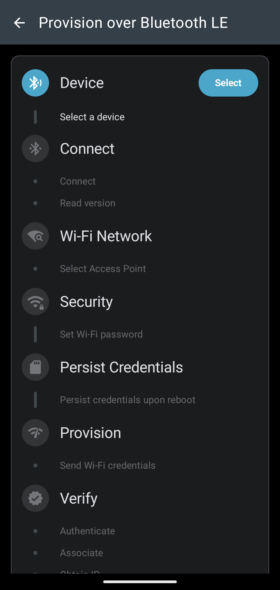
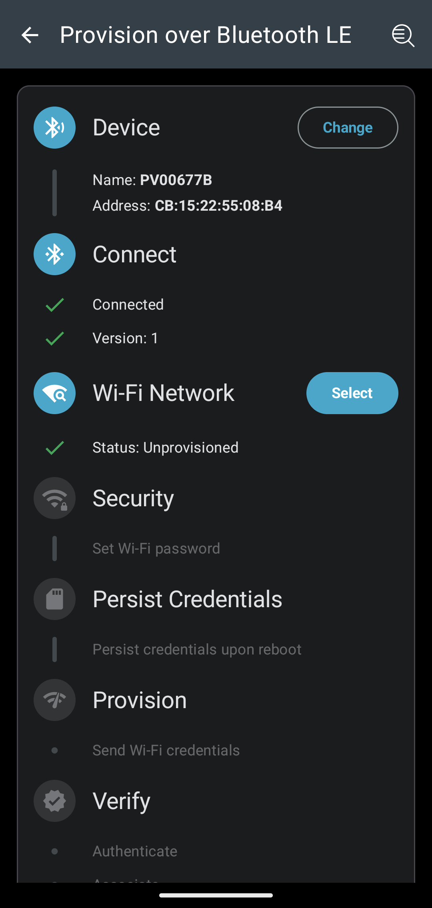
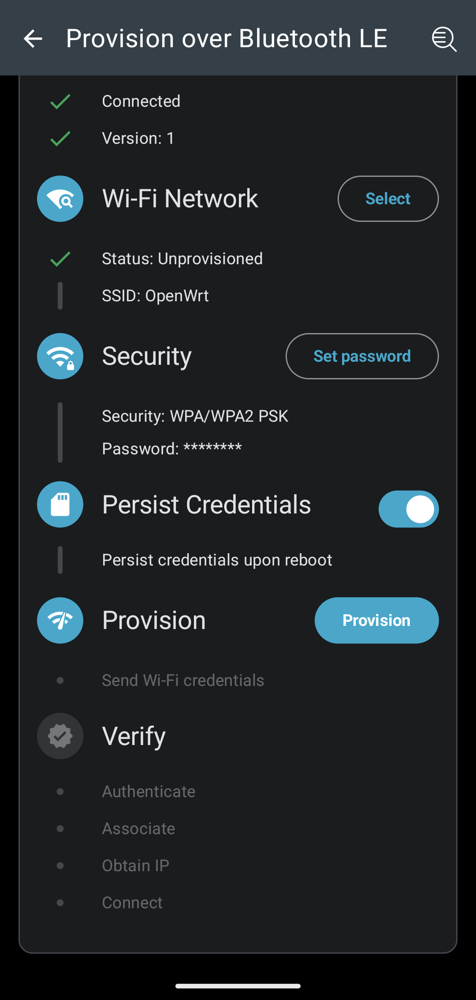
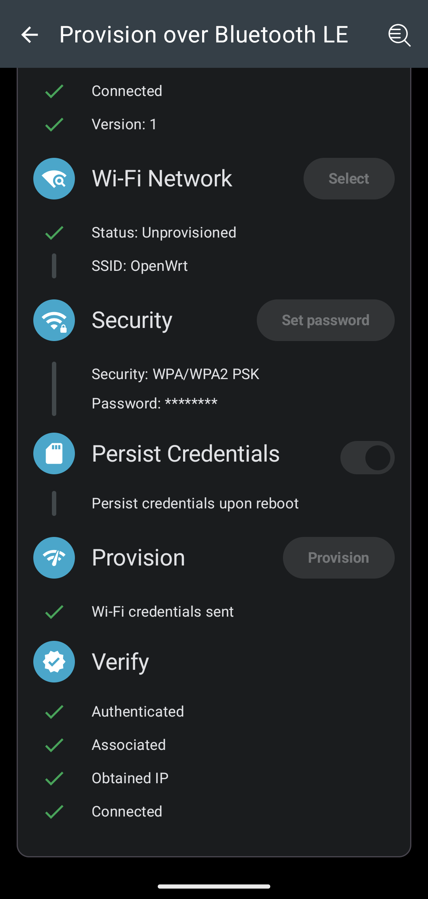
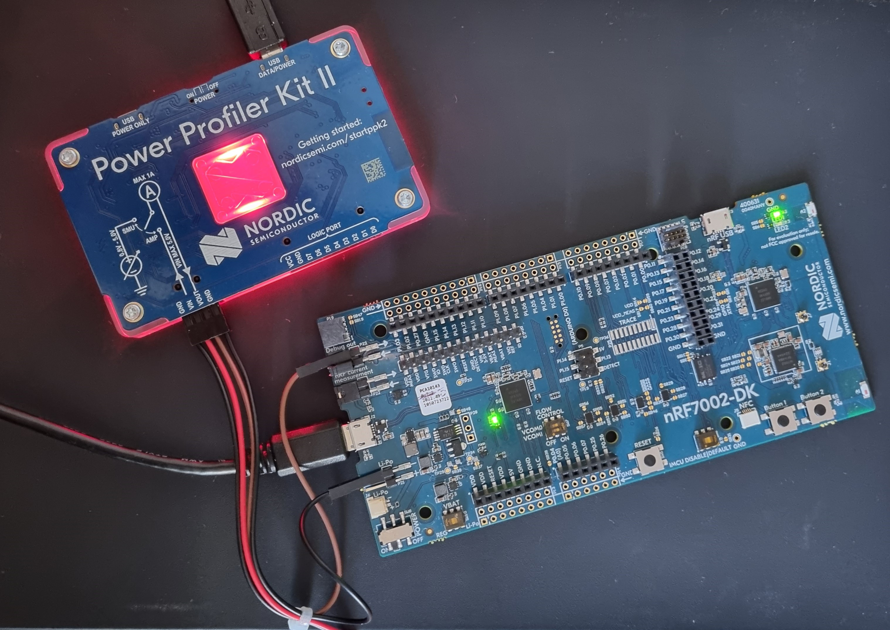
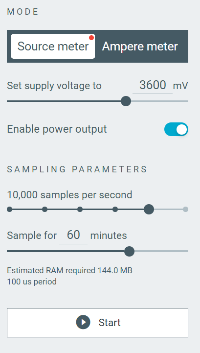
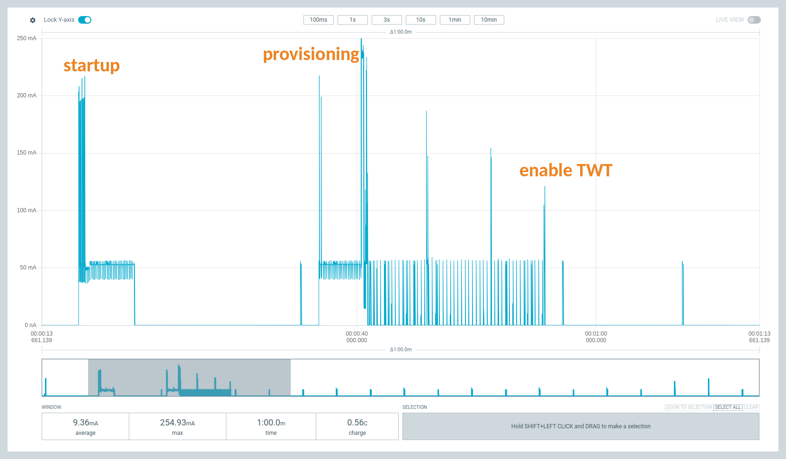
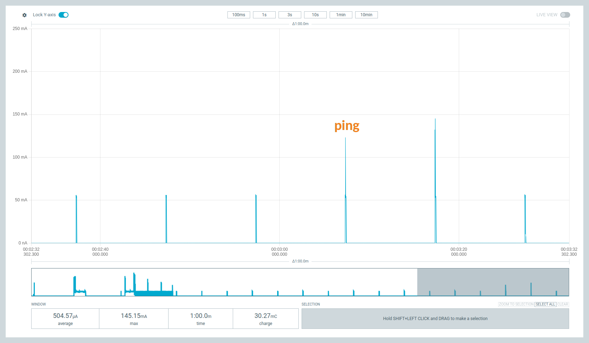
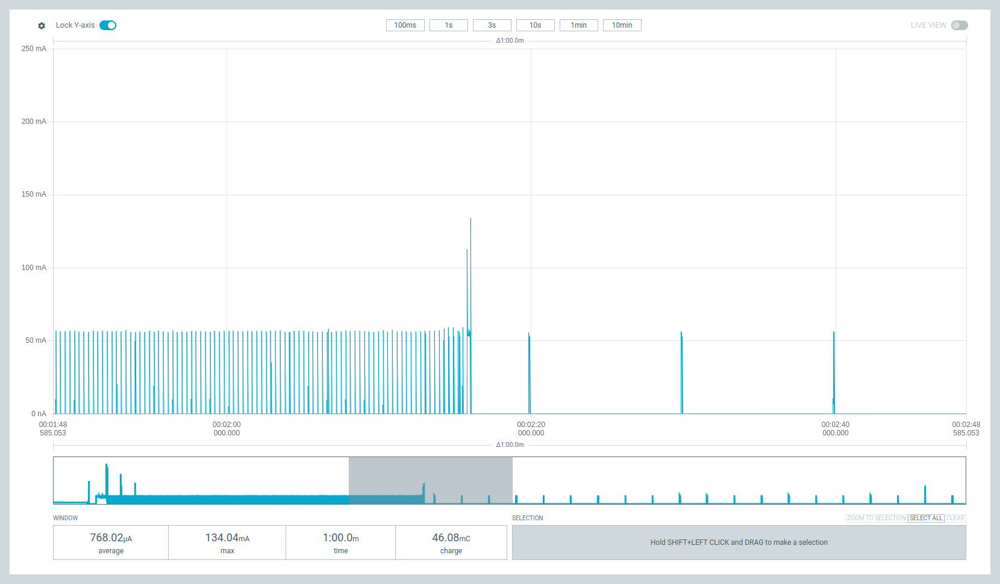

# Wi-Fi TWT Provisioning Demo

<i> Based on [Wi-Fi: Bluetooth LE based provision](https://docs.nordicsemi.com/bundle/ncs-2.7.0/page/nrf/samples/wifi/provisioning/ble/README.html) in nRF Connect SDK and [Rallare's Wi-Fi Provisioning demo](https://github.com/Rallare/fw-nrfconnect-nrf/tree/provisioning_demo_app/samples/wifi/provisioning).<br>
Tested SDK versions: v2.6.0, v2.7.0<br>
</i>

<i>NB: Ensure that your Wi-Fi 6 access point supports TWT and that TWT is enabled in the access point's settings.</i>

# Table of Contents
1. [Requirements](#requirements)
2. [Configuration](#configuration)
    1. [Provisioning](#provisioning)
    2. [TWT configurations](#twt-configurations)
    3. [Current measurement](#current-measurement)
3. [User interface](#user-interface)
4. [Testing](#testing)
5. [Power Profiler plots](#power-profiler-plots)
6. [Target Wake Time (TWT)](#target-wake-time-twt)
7. [Troubleshooting](#troubleshooting)
    1. [Provisioning issues](#provisioning-issues)
    2. [Power Profiler issues](#power-profiler-issues)
    3. [nRF7002 DK issues](#nrf7002-dk-issues)

## Requirements
- nRF7002 DK <i>(nrf7002dk_nrf5340_cpuapp or nrf7002dk/nrf5340/cpuapp for SDK >= v2.7)</i>
- PPK2

You also need a phone or tablet with the nRF Wi-Fi Provisioner app ([Android](https://play.google.com/store/apps/details?id=no.nordicsemi.android.wifi.provisioning)|[Apple](https://apps.apple.com/gb/app/nrf-wi-fi-provisioner/id1638948698)), and a computer with the [Power Profiler app](https://www.nordicsemi.com/Products/Development-tools/nRF-Connect-for-Desktop).

<br>

## Configuration

### TWT configurations
By default, the TWT interval is set to 10 seconds and the TWT wake interval to 65 milliseconds. This can be changed in [prj.conf](prj.conf) using the following Kconfig options:
- `CONFIG_WIFI_TWT_WAKE_INTERVAL_MS`: Wake up time, how long the device is awake during each wake up.
- `CONFIG_WIFI_TWT_INTERVAL_MS`: Total TWT interval (interval = wake up time + sleeping time).

### Provisioning
1. Turn the DK on.
2. Open the nRF Wi-Fi Provisioner app and click <b>Provision over Bluetooth LE</b>.
3. Provision the device by following the instructions in the app. Make sure to select <b>Pair</b> if there is a pop-up.

<p align="middle">
  
   
  
</p>

When the device is provisioned, you should see the following:



### Current measurement
<b>PPK2 setup</b>

Connect the PPK2 to the nRF7002 DK as shown in the picture:



| PPK2     | DK       |
| -------- | -------- |
| VOUT     | P23      |
| GND      | P21      |

<b>Power Profiler</b>
Select source meter mode, set the supply voltage to 3.6 volts, and enable power output. 



## User interface 

<b>LED 1:</b>
>Turns on when TWT is enabled.

<b>LED 2:</b>
>Turns on when button 2 is pressed to ping and turns off after receiving ping response.

<b>Button 1:</b>
>Enables/disables Target Wake Time mode.

<b>Button 2:</b>
>Schedules ping for next wakeup period.

## Testing

1. Set up PPK2 and Power Profiler as explained in [Current measurement](#current-measurement) and start current measurement.
2. Turn on and provision the DK as explained in [Provisioning](#provisioning).
3. Press button 1 to enable TWT. Pressing button 1 again will disable TWT.
4. Press button 2 to send a ping.

The following log shows the device being provisioned, TWT enable, scheduling ping, and TWT teardown.

```
[00:00:00.452,667] <inf> fs_nvs: 2 Sectors of 4096 bytes
[00:00:00.452,697] <inf> fs_nvs: alloc wra: 0, fe8
[00:00:00.452,697] <inf> fs_nvs: data wra: 0, 0
*** Booting nRF Connect SDK v2.7.0-5cb85570ca43 ***
*** Using Zephyr OS v3.6.99-100befc70c74 ***
[00:00:00.452,880] <inf> net_config: Initializing network
[00:00:00.452,911] <inf> net_config: Waiting interface 1 (0x20001a00) to be up...
[00:00:00.452,911] <inf> net_config: Running dhcpv4 client...
[00:00:01.484,741] <inf> bt_hci_core: HW Platform: Nordic Semiconductor (0x0002)
[00:00:01.484,771] <inf> bt_hci_core: HW Variant: nRF53x (0x0003)
[00:00:01.484,802] <inf> bt_hci_core: Firmware: Standard Bluetooth controller (0x00) Version 214.51162 Build 1926957230
[00:00:01.520,538] <inf> bt_hci_core: Identity: CB:15:22:55:08:B4 (random)
[00:00:01.520,568] <inf> bt_hci_core: HCI: version 5.4 (0x0d) revision 0x21fb, manufacturer 0x0059
[00:00:01.520,599] <inf> bt_hci_core: LMP: version 5.4 (0x0d) subver 0x21fb
Bluetooth initialized.
Wi-Fi provisioning service starts successfully.
BT Advertising successfully started.
BT Connected: 71:44:85:4D:B4:F8 (random)BT pairing completed: 71:44:85:4D:B4:F8 (random), bonded: 0
BT Security changed: 71:44:85:4D:B4:F8 (random) level 2.
[00:00:14.338,653] <inf> wifi_prov: Wi-Fi Provisioning service - control point: indications enabled
[00:00:14.653,656] <inf> wifi_prov: Wi-Fi Provisioning service - data out: notifications enabled
[00:00:15.103,698] <inf> wifi_prov: Start parsing...
[00:00:15.103,698] <inf> wifi_prov: GET_STATUS received...
[00:00:16.183,593] <inf> wifi_prov: Start parsing...
[00:00:16.183,624] <inf> wifi_prov: Start_Scan received...
[00:00:22.933,624] <inf> wifi_prov: Start parsing...
[00:00:22.933,654] <inf> wifi_prov: Stop_Scan received...
[00:00:34.725,341] <inf> wifi_prov: Start parsing...
[00:00:34.725,372] <inf> wifi_prov: Set_config received...
[00:00:45.263,702] <inf> net_dhcpv4: Received: 192.168.32.104
[00:00:45.263,824] <inf> net_config: IPv4 address: 192.168.32.104
[00:00:45.263,854] <inf> net_config: Lease time: 36000 seconds
[00:00:45.263,885] <inf> net_config: Subnet: 255.255.255.0
[00:00:45.263,916] <inf> net_config: Router: 192.168.32.1
[00:00:55.090,637] <inf> wifi_twt: -------------------------------
[00:00:55.090,667] <inf> wifi_twt: TWT operation TWT setup requested
[00:00:55.090,667] <inf> wifi_twt: -------------------------------
[00:00:55.152,008] <inf> wifi_twt: TWT response: TWT accept
[00:00:55.152,038] <inf> wifi_twt: == TWT negotiated parameters ==
[00:00:55.152,038] <inf> wifi_twt: TWT Dialog token: 1
[00:00:55.152,038] <inf> wifi_twt: TWT flow ID: 0
[00:00:55.152,069] <inf> wifi_twt: TWT negotiation type: TWT individual negotiation
[00:00:55.152,099] <inf> wifi_twt: TWT responder: true
[00:00:55.152,099] <inf> wifi_twt: TWT implicit: true
[00:00:55.152,130] <inf> wifi_twt: TWT announce: false
[00:00:55.152,160] <inf> wifi_twt: TWT trigger: false
[00:00:55.152,160] <inf> wifi_twt: TWT wake interval: 65 ms (65024 us)
[00:00:55.152,191] <inf> wifi_twt: TWT interval: 10 s (10010000 us)
[00:00:55.152,191] <inf> wifi_twt: ===============================
[00:00:55.152,832] <inf> wifi_twt: TWT sleep state: sleeping
[00:00:56.630,126] <inf> wifi_twt: TWT sleep state: awake
[00:00:56.694,915] <inf> wifi_twt: TWT sleep state: sleeping

[00:02:46.743,347] <inf> wifi_twt: TWT sleep state: awake
[00:02:46.829,498] <inf> wifi_twt: TWT sleep state: sleeping
[00:02:56.754,547] <inf> wifi_twt: TWT sleep state: awake
[00:02:56.842,742] <inf> wifi_twt: TWT sleep state: sleeping
[00:03:06.765,228] <inf> ping: Ping scheduled, seq=1
[00:03:06.766,021] <inf> wifi_twt: TWT sleep state: awake
[00:03:06.779,785] <inf> ping: 28 bytes received from 192.168.32.1: seq=1 ttl=64 time=14 ms
[00:03:06.855,865] <inf> wifi_twt: TWT sleep state: sleeping
[00:03:16.776,794] <inf> wifi_twt: TWT sleep state: awake
[00:03:16.868,927] <inf> wifi_twt: TWT sleep state: sleeping

[00:39:42.312,316] <inf> wifi_twt: -------------------------------
[00:39:42.312,347] <inf> wifi_twt: TWT operation TWT teardown requested
[00:39:42.312,347] <inf> wifi_twt: -------------------------------
[00:39:42.312,438] <inf> wifi_twt: TWT teardown received for flow ID 0
```

## Power Profiler plots

### Startup, provisioning and enabling TWT


### TWT with ping


### Legacy power save mode vs TWT


An example power profiler file can be found in [power_profiler_data](power_profiler_data), which can be opened in the Power Profiler app.

## Target Wake Time (TWT)

With TWT, you can specify when and how frequently the device should wake up to send or receive data. This allows the device to be in low-power mode for much longer, thus significantly decreasing the average current consumption. In this demo, the default TWT interval, i.e., the expected average time between successive TWT wakeups, is, by default, 10 seconds. The interval can be changed by setting the value of `CONFIG_WIFI_TWT_INTERVAL_MS` in [prj.conf](prj.conf).

For more information, see our documentation on [Target Wake Time (TWT)](https://docs.nordicsemi.com/bundle/ncs-2.7.0/page/nrf/protocols/wifi/station_mode/powersave.html#target_wake_time_twt).

## Troubleshooting

### Provisioning issues
<b>Not able to connect to the nRF7002 DK with my phone/tablet.</b>

Sometimes pairing fails, and in those cases retrying will solve the issue most of the time. However, if you get BT Disconnected with reason 0x2a directly after BT Connected, you will not be able to connect and pair with your phone/tablet.

```
wifi_prov: connected: BT Connected: 79:D5:85:87:92:F2 (random)
wifi_prov: disconnected: BT Disconnected: 79:D5:85:87:92:F2 (random) (reason 0x2a).
```
This issue has been seen with certain Android phones. If you get this issue, use another phone/tablet to provision the device.

<b>Scanning error when trying to provision</b>

If you get an error about "Scanning error when trying to provision" in the Wi-Fi Provisioner app, the issue is likely due to the wlan0 driver interface not being initialized correctly. This can be seen in the log from the device:
```
<err> wpa_supp: wpa_printf_impl: wpa_drv_zep_init: Interface wlan0 not found
<err> wpa_supp: wpa_printf_impl: wlan0: Failed to initialize driver interface
```
If this is the case, turn the nRF7002 DK off and wait a few seconds before you turn it on again.

### Power Profiler issues
<b>Expected behavior</b>

When the device is not in lower power mode, the current consumption is around 50-60 mA. In TWT mode, the device should have 100-200 ms periods where the current consumption is about 15 µA +- 3 µA. When scheduling a ping, you should get spikes of around 160 mA for transmitting and receiving on the next wakeup periods.

<b>Strange spikes in Power Profiler</b>

Strange spikes in the Power Profiler of 100s of mA come from the PPK2. If this happens once in a while, it is fine, but if it starts happening often, reboot the Power Profiler app (ctrl + R), restart sampling, and reboot the nRF7002 DK. 

<b>Power Profiler constantly showing current consumption of around 9 mA</b>

If this happens, the PPK2 is not measuring the current consumption of the nRF7002 DK. In this case, reboot the Power Profiler app (ctrl + R), restart sampling, and reboot the nRF7002 DK.

### nRF7002 DK issues

<b>How to reprogram the device</b>

You can find the precompiled firmware in precompiled_hex. The merged_domains.hex file can be used to program both cores simultaneously using the nRF Connect Programmer app. The device can also be programmed using nrfjprog, programming each core separately.
To program with nrfjprog, open the precompiled_hex folder in a terminal and run the following:
```
nrfjprog -f NRF53 --coprocessor CP_NETWORK --program merged_CPUNET.hex --chiperase \
nrfjprog -f NRF53 --program merged_CPUAPP.hex --chiperase \
nrfjprog --pinreset
```

<b>nRF7002 DK does not start up correctly/show up in Wi-Fi Provisioner app after starting up</b>
Turn the nRF7002 DK off and wait a few seconds before turning it on again.

<b>Issue with the jumper while programming and booting the device</b>

Sometimes programming and booting the device with PPK2 connected might fail. In those cases, disconnect the PPK2 before programming/booting the device, and reconnect it after the device has started up.
